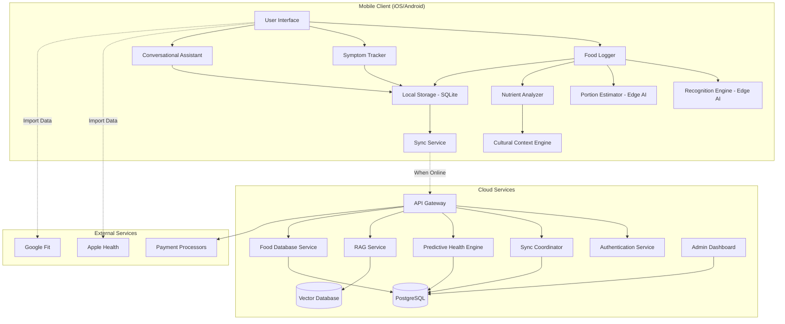

# Technical Design Document: AI Nutrition App

## Overview

The AI Nutrition App is a cross-platform mobile application that leverages on-device AI models, offline-first architecture, and cultural intelligence to provide personalized nutrition tracking and health insights. The system is designed around three core principles: privacy through edge computing, accessibility through offline functionality, and relevance through cultural awareness.

The architecture consists of three primary layers:
1. **Mobile Client Layer**: Native iOS/Android apps with embedded AI models
2. **Synchronization Layer**: Conflict-free data sync with eventual consistency
3. **Cloud Services Layer**: Backend APIs, premium analytics, and RAG infrastructure

## Architecture

### High-Level System Architecture



### Offline-First Architecture Pattern

The system implements a local-first architecture where all core functionality operates without network connectivity:

1. **Local Processing**: All AI inference (food recognition, portion estimation) runs on-device
2. **Local Storage**: Complete data model stored in SQLite with full query capabilities
3. **Eventual Sync**: Background synchronization when connectivity available
4. **Conflict Resolution**: Last-write-wins with vector clocks for conflict detection

### Data Flow

**Food Logging Flow:**
```
User Input (Image/Voice/Text) 
  → Recognition Engine (on-device) 
  → Portion Estimator (on-device)
  → Cultural Context Engine (adjustments)
  → Nutrient Analyzer (local database)
  → Local Storage
  → [When Online] Sync to Cloud
```

**Predictive Analytics Flow:**
```
Local Storage (meals + symptoms + wearable data)
  → [When Online] Sync to Cloud
  → Predictive Health Engine (cloud processing)
  → Correlation Analysis
  → Insights pushed to device
  → Local Storage (cached insights)
```

## Components and Interfaces

### 1. Food Logger Component

**Responsibility**: Orchestrate multi-modal food input and coordinate recognition pipeline

**Interface:**
```typescript
interface FoodLogger {
  logFromImage(image: ImageData): Promise<FoodLogEntry>
  logFromVideo(video: VideoData): Promise<FoodLogEntry>
  logFromVoice(audio: AudioData): Promise<FoodLogEntry>
  logFromText(text: string): Promise<FoodLogEntry>
  confirmEntry(entry: FoodLogEntry): Promise<void>
  adjustPortion(entryId: string, newPortion: Portion): Promise<void>
}

interface FoodLogEntry {
  id: string
  timestamp: Date
  foods: FoodItem[]
  totalNutrition: NutritionProfile
  inputMode: 'image' | 'video' | 'voice' | 'text'
  confidence: number
  synced: boolean
}

interface FoodItem {
  name: string
  portion: Portion
  nutrition: NutritionProfile
  cuisine: string
  confidence: number
}
```

**Dependencies**: Recognition Engine, Portion Estimator, Nutrient Analyzer, Local Storage

### 2. Recognition Engine (Edge AI)

**Responsibility**: Identify food items from visual input using on-device ML models

**Technology Stack:**
- iOS: Core ML with Vision framework
- Android: TensorFlow Lite
- Base Model: MobileNetV3 or EfficientNet-Lite fine-tuned on food datasets
- Model Size: <50MB for on-device deployment

**Interface:**
```typescript
interface RecognitionEngine {
  recognizeFromImage(image: ImageData): Promise<RecognitionResult[]>
  recognizeFromVideoFrame(frame: ImageData): Promise<RecognitionResult[]>
  getModelVersion(): string
  updateModel(modelData: ArrayBuffer): Promise<void>
}

interface RecognitionResult {
  foodId: string
  foodName: string
  confidence: number
  boundingBox?: Rectangle
  alternatives: Array<{foodId: string, confidence: number}>
}
```

**Model Architecture:**
- Input: 224x224 RGB image
- Output: Top-5 food classes with confidence scores
- Inference Time: <300ms on mid-range devices
- Training Data: Combination of Food-101, UECFOOD-256, and custom cultural food datasets

### 3. Portion Estimator (Edge AI)

**Responsibility**: Calculate serving sizes from visual cues or voice descriptors

**Technology Stack:**
- Depth Estimation: ARKit (iOS) / ARCore (Android) for reference object detection
- Volume Estimation: Custom regression model trained on portion datasets
- Voice Parsing: On-device speech recognition + NLP for quantity extraction

**Interface:**
```typescript
interface PortionEstimator {
  estimateFromImage(image: ImageData, foodId: string): Promise<PortionEstimate>
  estimateFromVoice(transcript: string, foodId: string): Promise<PortionEstimate>
  estimateFromText(description: string, foodId: string): Promise<PortionEstimate>
}

interface PortionEstimate {
  amount: number
  unit: 'g' | 'ml' | 'cup' | 'piece' | 'serving'
  confidence: number
  confidenceRange: {min: number, max: number}
  referenceObjectDetected: boolean
}
```

**Estimation Strategy:**
1. Detect reference objects (utensils, hands, standard containers)
2. Calculate food volume using depth estimation
3. Apply density factors based on food type
4. Adjust for cultural serving norms from Cultural Context Engine

### 4. Nutrient Analyzer

**Responsibility**: Calculate nutritional values from identified foods and portions

**Interface:**
```typescript
interface NutrientAnalyzer {
  analyze(foodId: string, portion: Portion, context: CulturalContext): Promise<NutritionProfile>
  recalculate(entry: FoodLogEntry, newPortion: Portion): Promise<NutritionProfile>
}

interface NutritionProfile {
  calories: number
  protein: number
  carbohydrates: number
  fat: number
  fiber: number
  micronutrients: Map<string, number>
  confidenceRange?: {min: number, max: number}
}
```

**Data Source**: Local SQLite database with nutritional information per 100g/100ml

### 5. Cultural Context Engine

**Responsibility**: Adapt nutritional analysis and recommendations based on cuisine and cultural eating patterns

**Interface:**
```typescript
interface CulturalContextEngine {
  getCookingAdjustment(foodId: string, cuisine: string): NutritionAdjustment
  getPortionNorm(foodId: string, cuisine: string): PortionNorm
  divideSharedMeal(meal: FoodLogEntry, servings: number): FoodLogEntry[]
  suggestAlternatives(foodId: string, cuisine: string): FoodItem[]
}

interface CulturalContext {
  primaryCuisine: string
  secondaryCuisines: string[]
  cookingMethods: string[]
  servingSizePreferences: 'small' | 'medium' | 'large'
}

interface NutritionAdjustment {
  calorieMultiplier: number
  fatAdjustment: number
  sodiumAdjustment: number
  reason: string
}
```

**Supported Cuisines (MVP):**
- South Asian (Indian, Pakistani, Bangladeshi)
- East Asian (Chinese, Japanese, Korean)
- Southeast Asian (Thai, Vietnamese, Filipino)
- Mediterranean (Greek, Turkish, Lebanese)
- Latin American (Mexican, Brazilian, Colombian)

**Adjustment Factors:**
- Cooking method impacts (frying, steaming, grilling)
- Regional ingredient variations (oil types, spice blends)
- Portion size cultural norms
- Shared meal division patterns

### 6. Symptom Tracker

**Responsibility**: Record and manage user-reported health symptoms

**Interface:**
```typescript
interface SymptomTracker {
  logSymptom(symptom: Symptom): Promise<void>
  getSymptoms(dateRange: DateRange): Promise<Symptom[]>
  updateSymptom(symptomId: string, updates: Partial<Symptom>): Promise<void>
}

interface Symptom {
  id: string
  timestamp: Date
  category: 'digestive' | 'energy' | 'mood' | 'physical' | 'sleep' | 'other'
  description: string
  severity: 1 | 2 | 3 | 4 | 5
  timingRelativeToMeal?: 'before' | 'during' | 'after_1h' | 'after_2h' | 'after_4h'
  synced: boolean
}
```

### 7. Predictive Health Engine (Cloud Service)

**Responsibility**: Analyze correlations between diet, symptoms, and activity data

**Technology Stack:**
- Python with scikit-learn for statistical analysis
- Time-series correlation analysis
- Minimum 14 days of data required for pattern detection

**Interface:**
```typescript
interface PredictiveHealthEngine {
  analyzeCorrelations(userId: string): Promise<HealthInsight[]>
  getRecommendations(userId: string, context: UserContext): Promise<Recommendation[]>
}

interface HealthInsight {
  type: 'food_symptom_correlation' | 'nutrient_deficiency' | 'eating_pattern'
  confidence: number
  description: string
  affectedFoods: string[]
  affectedSymptoms?: string[]
  timeframe: DateRange
  statisticalSignificance: number
}

interface Recommendation {
  title: string
  description: string
  actionable: boolean
  culturallyRelevant: boolean
  priority: 'high' | 'medium' | 'low'
}
```

**Analysis Methods:**
- Pearson correlation for continuous variables
- Chi-square tests for categorical associations
- Time-lagged correlation analysis (0-24 hour windows)
- False discovery rate correction for multiple comparisons

### 8. Conversational Assistant (RAG-based)

**Responsibility**: Provide personalized nutrition Q&A using retrieval-augmented generation

**Technology Stack:**
- On-device: Small language model for basic queries (e.g., Phi-2, Gemma)
- Cloud: Larger LLM (GPT-4, Claude) with RAG pipeline
- Vector Database: Pinecone or Weaviate for nutrition knowledge base
- Embeddings: OpenAI text-embedding-3 or similar

**Interface:**
```typescript
interface ConversationalAssistant {
  askQuestion(query: string, context: UserContext): Promise<AssistantResponse>
  getRecipeSuggestions(preferences: RecipePreferences): Promise<Recipe[]>
  explainNutrient(nutrient: string): Promise<string>
}

interface AssistantResponse {
  answer: string
  sources: Source[]
  personalized: boolean
  requiresPremium: boolean
  followUpSuggestions: string[]
}

interface UserContext {
  recentMeals: FoodLogEntry[]
  dietaryRestrictions: string[]
  healthGoals: string[]
  culturalPreferences: CulturalContext
}
```

**RAG Pipeline:**
1. Query embedding generation
2. Vector similarity search in nutrition knowledge base
3. Context retrieval (top-k relevant documents)
4. User history integration
5. LLM prompt construction with retrieved context
6. Response generation with source attribution

**Knowledge Base Sources:**
- USDA FoodData Central
- WHO nutrition guidelines
- Peer-reviewed nutrition research papers
- Cultural cuisine databases
- Recipe collections

### 9. Sync Service

**Responsibility**: Synchronize local data with cloud backend when connectivity available

**Interface:**
```typescript
interface SyncService {
  sync(): Promise<SyncResult>
  enableAutoSync(enabled: boolean): void
  getLastSyncTime(): Date | null
  resolveConflict(conflict: DataConflict): Promise<void>
}

interface SyncResult {
  success: boolean
  itemsSynced: number
  conflicts: DataConflict[]
  lastSyncTime: Date
}

interface DataConflict {
  entityType: 'meal' | 'symptom' | 'preference'
  localVersion: any
  remoteVersion: any
  timestamp: Date
}
```

**Sync Strategy:**
- Incremental sync using change tracking
- Vector clocks for conflict detection
- Last-write-wins with user override option
- Batch uploads to minimize network requests
- Delta sync for large datasets

### 10. Wearable Integration

**Responsibility**: Import health and activity data from external platforms

**Interface:**
```typescript
interface WearableIntegration {
  connectAppleHealth(): Promise<void>
  connectGoogleFit(): Promise<void>
  importActivityData(dateRange: DateRange): Promise<ActivityData>
  importSleepData(dateRange: DateRange): Promise<SleepData>
  disconnect(platform: 'apple' | 'google'): Promise<void>
}

interface ActivityData {
  date: Date
  steps: number
  activeMinutes: number
  caloriesBurned: number
  heartRateAvg?: number
  heartRateMax?: number
}

interface SleepData {
  date: Date
  totalMinutes: number
  deepSleepMinutes: number
  remSleepMinutes: number
  quality: number
}
```

## Data Models

### Local Storage Schema (SQLite)

```sql
-- Food Log Entries
CREATE TABLE food_log_entries (
  id TEXT PRIMARY KEY,
  timestamp INTEGER NOT NULL,
  input_mode TEXT NOT NULL,
  total_calories REAL,
  total_protein REAL,
  total_carbs REAL,
  total_fat REAL,
  synced INTEGER DEFAULT 0,
  version INTEGER DEFAULT 1,
  created_at INTEGER NOT NULL,
  updated_at INTEGER NOT NULL
);

-- Food Items within entries
CREATE TABLE food_items (
  id TEXT PRIMARY KEY,
  entry_id TEXT NOT NULL,
  food_id TEXT NOT NULL,
  food_name TEXT NOT NULL,
  portion_amount REAL NOT NULL,
  portion_unit TEXT NOT NULL,
  calories REAL,
  protein REAL,
  carbs REAL,
  fat REAL,
  cuisine TEXT,
  confidence REAL,
  FOREIGN KEY (entry_id) REFERENCES food_log_entries(id) ON DELETE CASCADE
);

-- Symptoms
CREATE TABLE symptoms (
  id TEXT PRIMARY KEY,
  timestamp INTEGER NOT NULL,
  category TEXT NOT NULL,
  description TEXT,
  severity INTEGER NOT NULL,
  timing_relative_to_meal TEXT,
  synced INTEGER DEFAULT 0,
  created_at INTEGER NOT NULL
);

-- User Preferences
CREATE TABLE user_preferences (
  key TEXT PRIMARY KEY,
  value TEXT NOT NULL,
  updated_at INTEGER NOT NULL
);

-- Food Database (bundled with app)
CREATE TABLE foods (
  id TEXT PRIMARY KEY,
  name TEXT NOT NULL,
  cuisine TEXT,
  calories_per_100g REAL,
  protein_per_100g REAL,
  carbs_per_100g REAL,
  fat_per_100g REAL,
  fiber_per_100g REAL,
  micronutrients TEXT, -- JSON
  version INTEGER
);

-- Cultural Adjustments
CREATE TABLE cultural_adjustments (
  food_id TEXT NOT NULL,
  cuisine TEXT NOT NULL,
  cooking_method TEXT,
  calorie_multiplier REAL DEFAULT 1.0,
  fat_adjustment REAL DEFAULT 0,
  sodium_adjustment REAL DEFAULT 0,
  PRIMARY KEY (food_id, cuisine, cooking_method)
);

-- Cached Insights
CREATE TABLE health_insights (
  id TEXT PRIMARY KEY,
  type TEXT NOT NULL,
  confidence REAL,
  description TEXT,
  data TEXT, -- JSON
  created_at INTEGER NOT NULL,
  expires_at INTEGER
);

-- Sync Metadata
CREATE TABLE sync_metadata (
  entity_type TEXT PRIMARY KEY,
  last_sync_timestamp INTEGER,
  vector_clock TEXT -- JSON
);
```

### Cloud Database Schema (PostgreSQL)

```sql
-- Users
CREATE TABLE users (
  id UUID PRIMARY KEY DEFAULT gen_random_uuid(),
  email TEXT UNIQUE NOT NULL,
  subscription_tier TEXT DEFAULT 'free',
  subscription_expires_at TIMESTAMP,
  created_at TIMESTAMP DEFAULT NOW(),
  updated_at TIMESTAMP DEFAULT NOW()
);

-- User Profiles
CREATE TABLE user_profiles (
  user_id UUID PRIMARY KEY REFERENCES users(id) ON DELETE CASCADE,
  primary_cuisine TEXT,
  dietary_restrictions TEXT[], -- Array
  health_goals TEXT[],
  onboarding_completed BOOLEAN DEFAULT FALSE,
  updated_at TIMESTAMP DEFAULT NOW()
);

-- Synced Food Logs
CREATE TABLE food_logs (
  id UUID PRIMARY KEY,
  user_id UUID NOT NULL REFERENCES users(id) ON DELETE CASCADE,
  timestamp TIMESTAMP NOT NULL,
  input_mode TEXT NOT NULL,
  foods JSONB NOT NULL,
  nutrition JSONB NOT NULL,
  device_id TEXT,
  version INTEGER DEFAULT 1,
  created_at TIMESTAMP DEFAULT NOW(),
  updated_at TIMESTAMP DEFAULT NOW()
);

CREATE INDEX idx_food_logs_user_timestamp ON food_logs(user_id, timestamp DESC);

-- Synced Symptoms
CREATE TABLE symptoms (
  id UUID PRIMARY KEY,
  user_id UUID NOT NULL REFERENCES users(id) ON DELETE CASCADE,
  timestamp TIMESTAMP NOT NULL,
  category TEXT NOT NULL,
  description TEXT,
  severity INTEGER NOT NULL,
  timing_relative_to_meal TEXT,
  created_at TIMESTAMP DEFAULT NOW()
);

CREATE INDEX idx_symptoms_user_timestamp ON symptoms(user_id, timestamp DESC);

-- Wearable Data
CREATE TABLE wearable_data (
  id UUID PRIMARY KEY DEFAULT gen_random_uuid(),
  user_id UUID NOT NULL REFERENCES users(id) ON DELETE CASCADE,
  date DATE NOT NULL,
  steps INTEGER,
  active_minutes INTEGER,
  calories_burned REAL,
  sleep_minutes INTEGER,
  data JSONB, -- Additional metrics
  source TEXT NOT NULL, -- 'apple_health' or 'google_fit'
  created_at TIMESTAMP DEFAULT NOW(),
  UNIQUE(user_id, date, source)
);

-- Computed Insights
CREATE TABLE computed_insights (
  id UUID PRIMARY KEY DEFAULT gen_random_uuid(),
  user_id UUID NOT NULL REFERENCES users(id) ON DELETE CASCADE,
  type TEXT NOT NULL,
  confidence REAL,
  description TEXT,
  data JSONB,
  date_range_start DATE,
  date_range_end DATE,
  created_at TIMESTAMP DEFAULT NOW()
);

-- Food Database (master)
CREATE TABLE foods_master (
  id TEXT PRIMARY KEY,
  name TEXT NOT NULL,
  cuisine TEXT,
  nutrition JSONB NOT NULL,
  version INTEGER DEFAULT 1,
  approved BOOLEAN DEFAULT FALSE,
  created_at TIMESTAMP DEFAULT NOW(),
  updated_at TIMESTAMP DEFAULT NOW()
);

-- User-submitted foods (pending approval)
CREATE TABLE food_submissions (
  id UUID PRIMARY KEY DEFAULT gen_random_uuid(),
  user_id UUID NOT NULL REFERENCES users(id),
  food_name TEXT NOT NULL,
  cuisine TEXT,
  nutrition JSONB,
  status TEXT DEFAULT 'pending', -- 'pending', 'approved', 'rejected'
  reviewed_at TIMESTAMP,
  created_at TIMESTAMP DEFAULT NOW()
);
```

### Vector Database Schema (for RAG)

```typescript
interface NutritionDocument {
  id: string
  content: string
  embedding: number[] // 1536-dim vector
  metadata: {
    source: string
    category: 'nutrient_info' | 'recipe' | 'research' | 'guideline'
    cuisine?: string
    datePublished?: string
    credibilityScore: number
  }
}
```

## Correctness Properties

*A property is a characteristic or behavior that should hold true across all valid executions of a system—essentially, a formal statement about what the system should do. Properties serve as the bridge between human-readable specifications and machine-verifiable correctness guarantees.*

Before defining the correctness properties, let me analyze the acceptance criteria for testability:

